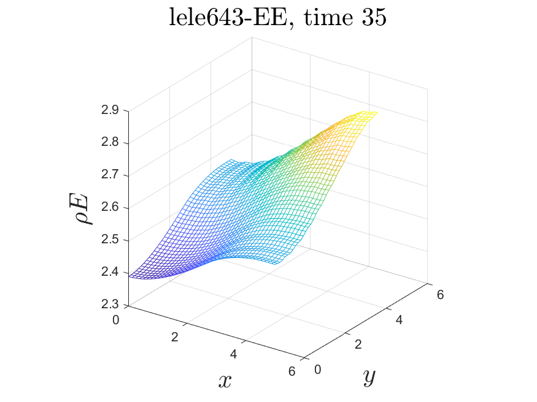

# Conservative Compact Schemes #

This repository contains short snippets that reproduce some of the invicid benchmark tests proposed in [1]:

## Test 1.1: Euler equations 1d, Gaussian wave with slip-walls boundaries 

| N |   Lele643   |      E8      |      T8      |
|:-:|:-----------:|:------------:|:------------:|
101 |  |  | 
q_int |  |  | 

## Test 2.1: Euler equations 2d, Gaussian wave with slip-walls boundaries

| NxM |   Lele643   |      E8      |      T8      |
|:---:|:-----------:|:------------:|:------------:|
61x61 |  |  | 
q_int |  |  | 

## Test 3.1: Euler equations 3d, Gaussian wave with slip-walls boundaries

| NxMxR  |   Lele643   |      E8      |      T8      |
|:------:|:-----------:|:------------:|:------------:|
41x41x41 |  |  | 
q_int |  |  | 

## Conclusion:
* Because the compact schemes presented in [1] have been taylored to work well with Dirichlet (homogeneous) boundary conditions. There is no need for using a skew-symmetric formulation of the convective operators. (The skew-symmetric from of the convective terms in reality adds small amounts of numerical diffusion in the scheme).
* Classical schemes such as Lele643 [2] or Pade43 [3], fail in the short term due spurios oscilations that emanate from the boundaries. This is the reason why compact schemes normaly rely on filters to keep the solution stable.
* By integrating the conserved quantities over time, is easy to see that the schemes proposed in [1] are truly conservative and stable for very long time simulations (Or at least until the formation of a shockwave) and do not need any filtering or the addition of artificial viscosity. Therefore, they are high-order conservatives compact schemes in the pure finite-difference sense.

-- Manuel A. Diaz, 2021.

## Future work:
* In a similar fassion, perhaps, one could taylor a compact-scheme for the Navier-Stokes equations. But this time using some basic characteristic boundary-conditions: inflow, outflow, isothermal-walls.
* This boundaries are not suitalbe for studying cases where shock from. How thery compare to classical BCs for WENO methods?

## References:
[1] Brady, P. T., & Livescu, D. (2019). High-order, stable, and conservative boundary schemes for central and compact finite differences. Computers & Fluids, 183, 84-101.

[2] Laizet, S., & Lamballais, E. (2009). High-order compact schemes for incompressible flows: A simple and efficient method with quasi-spectral accuracy. Journal of Computational Physics, 228(16), 5989-6015.

[3] Moin, P. (2010). Fundamentals of engineering numerical analysis. Cambridge University Press.
